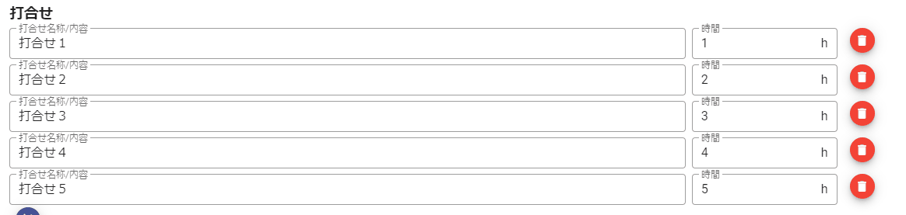

# Vuejs-study

Vue.js、Vuetify、Vuex、Vue CliなどVue関連の技術要素を触ってみてのメモやTipsをまとめています。  

# Vue.js

WebアプリのUIを構築するためのJavaScriptフレームワークです。[公式サイト](https://jp.vuejs.org/v2/guide/)曰く、プログレッシグフレームワークとのこと。  

## 【前提】Vus.jsを学ぶには

前提知識として、HTML、CSS、JavaScriptのある程度の知識があった方が学習がスムーズかなと。知識なしで進めることもできるけど、どこまでがVue.jsの世界なのか、そうでないのかの判断ができたほうが理解が早いので、少なくともHTML、CSS、JavaScriptの基礎知識を学んでからの方がベターだと思います。  
反対に、React、やAngular（Angular JS）など、フロントエンドの開発に使われる他のJavaScriptフレームワークを使ったことがあると、類似点が多いと感じたので理解が早いと思います。  

> 他のフレームワークとの比較は[Vus.jsの公式サイト](https://jp.vuejs.org/v2/guide/comparison.html)にも掲載されているので、参考になりそう。

## 学習時に参考になったサイト

- [Vue.js 公式サイト](https://jp.vuejs.org/)
- [Vue開発者のためのVue.jsベストプラクティス集15選](https://qiita.com/mtoyopet/items/87a32d8e3497c5421727?utm_source=Qiita%E3%83%8B%E3%83%A5%E3%83%BC%E3%82%B9&utm_campaign=377b3f45f5-Qiita_newsletter_398_02_05_2020&utm_medium=email&utm_term=0_e44feaa081-377b3f45f5-10314789)
- [今からVue.jsを始める人のための「知るのを後回しにしてよい」n個のこと](https://qiita.com/fruitriin/items/3249bb24d60932bb42ee?utm_source=Qiita%E3%83%8B%E3%83%A5%E3%83%BC%E3%82%B9&utm_campaign=8b22d08290-Qiita_newsletter_403_03_11_2020&utm_medium=email&utm_term=0_e44feaa081-8b22d08290-10314789)
- [ワイ「何でそんな小っさいコンポーネント作ってるん？ｗ」](https://qiita.com/Yametaro/items/e8cb39b1a20b762bfafa?utm_source=Qiita%E3%83%8B%E3%83%A5%E3%83%BC%E3%82%B9&utm_campaign=dc254c4ffe-Qiita_newsletter_417_07_01_2020&utm_medium=email&utm_term=0_e44feaa081-dc254c4ffe-10314789)
- [2020年後半版Vue.jsを使ってる人には必ず知っていてほしいVue.jsの武器とドキュメントに書かれていないコンポーネントやメンテナンスの際に役立つTips](https://qiita.com/kahirokunn/items/b4f3ede5b2eb94711880?utm_source=Qiita%E3%83%8B%E3%83%A5%E3%83%BC%E3%82%B9&utm_campaign=3d901c706b-Qiita_newsletter_420_07_22_2020&utm_medium=email&utm_term=0_e44feaa081-3d901c706b-10314789)
- [新Vue.js「Vue 3」でコンポーネント実装法を大きく変える「Composition API」](https://codezine.jp/article/detail/12584?utm_source=codezine_regular_20200722&utm_medium=email)
- [1週間でVue.jsをマスターしようと思った時に参考にしたサイト](https://qiita.com/mimoe/items/56784c9d17ed34ee7533)
- [アドベントカレンダーを作れるアプリを作ってみた【Vue.js×Firebase】](https://qiita.com/maroKanatani/items/7ca85205430cead76817)
- [基礎から学ぶVue.js](https://cr-vue.mio3io.com/)

## お手軽に触ってみる＆基本の構成

Vus.jsのインストール方法は色々あるけど、  
CDN`<script src="https://cdn.jsdelivr.net/npm/vue/dist/vue.js"></script>`を使って直ぐに試せる。  
Vue.jsの`el`オプションで指定した値が、HTML上でVueの影響を及ぼす範囲となる。

```html
<!DOCTYPE html>
<html lang="en">
<head>
  <meta charset="UTF-8">
  <meta name="viewport" content="width=device-width, initial-scale=1.0">
  <title>Document</title>
</head>
<body>
  <div id="app"><!-- Vueのelオプションで指定されている要素。Vueの影響を受ける要素となる-->
    <span>{{message}}</span>
  </div>
  <script src="https://cdn.jsdelivr.net/npm/vue/dist/vue.js"></script>
  <script src="index.js"></script>
</body>
</html>
```

```js
// index.js
const vm = new Vue({
  el: '#app', // ここで指定したHTMLの要素配下がVueの影響を及ぼす範囲となる
  data: {
    message: 'hello!',
  },
});
```


## 基本的な構文

### 展開（テキスト）

上記ですでに登場しているが…以下のように、中括弧を二重で、Vue.jsの`data`オプションで指定されているプロパティ`message`を書くと、HTMLとjs間でバインディングがされ、`message`プロパティの値が表示される。  
プロパティの値が変わる度に、表示内容が更新される。

```html
<span>{{message}}</span>
```

```js
data: {
    message: 'hello!',
},
```

### 展開（`v-bind`ディレクティブ）

HTMLの属性に対してバインディングする時に使う。`v-bind:属性`。省略して`:属性`でも宣言できる。

```html
<a v-bind:href="googleUrl">Go to Google site</a>
<a :href="googleUrl">Go to G Site</a>
```

```js
data: {
  googleUrl: 'https://google.com'
},
```


### `v-model`ディレクティブ

双方向バインディングができる。Form系の要素仕様で使用する。  
`v-model=dataオプションのプロパティ`

```html
<input v-model="fullName" placeholder="Please your name.">
<p>My Name: {{ fullName }}</p>
```

```js
data: {
  fullName : '',
},
```


### `v-if`ディレクティブ

要素を表示するか、削除するかを切り替えたい時に使う。`v-if`に指定されたプロパティ値が`True`の場合は要素が表示され、`False`の場合が削除される。

```html
<span v-if="isCoffee">Coffee!</span>
<span v-if="!isCoffee">No Coffee!</span>
```

```js
data: {
  isCoffee: true,
},
```


### リストレンダリング（`v-for`ディレクティブ）

配列を元に、アイテムのリストを生成できる。  
`v-for=単一の名称 in dataオプションのプロパティ名`をHTMLの要素に指定する。`v-for`で生成された要素の範囲内であれば、`単一の名称.プロパティ名`で各値にアクセスできるようになる。  
`v-for`ディレクティブでは、**必ず`key`属性も使う。**`key`属性にはユニークなキーを指定する。  
`key`属性の指定がない場合、`v-for`内の要素が順番通り表示されない場合があるっぽい。

また、[`v-if`と`v-for`を同時に利用するのは推奨されていない。](https://jp.vuejs.org/v2/guide/list.html#v-for-%E3%81%A8-v-if)

```html
<ul>
  <li v-for="food in foods" :key="food.id">{{food.name}}</li>
</ul>
```

```js
data: {
  foods: [
    {id:1,name:"りんご"},
    {id:2,name:"みかん"},
    {id:3,name:"メロン"},
  ],
},
```


### イベンドハンドリング（`v-on`ディレクティブ）

`v-on:hoge`でイベントリスナを設定できる。省略して`@hoge`でも宣言できる。  
ボタンクリック時のイベントを設定する場合は、`v-on:click`とすればよい。  
`v-on`にはワンライナーであればロジックを直接記載できるが、`methods`オプションにメソッドを用意し、そのメソッド名を記載するのがほとんどかと。

```html
<button v-on:click="counter += 1">Add 1</button>
<button @click="counter -= 1">Sub 1</button>
<button @click="add(2)">Add 2</button>
<button @click="sub(3)">Sub 3</button>
<p>The button above has been clicked {{ counter }} times.</p>
```

```js
data: {
  counter: 0,
},
methods:{
  add(count) {
    this.counter += count;
  },
  sub(count) {
    this.counter -= count;
  }
}
```


## Vueインスタンスと主なオプション

既に何度も登場しているが、Vueアプリケーションでは、`Vue`関数で新しいVueインスタンスを作成することで起動される。
>※Vueのデザインは、MVVMパターンの影響を受けているため、慣例として変数名を`vm`とする場合がある。

Vueインスタンスを生成する際に、`el`や`data`など様々なオプションを渡す。  
オプションの一覧は[公式サイトのAPIリファレンス](https://jp.vuejs.org/v2/api/#%E3%82%AA%E3%83%97%E3%82%B7%E3%83%A7%E3%83%B3-%E3%83%87%E3%83%BC%E3%82%BF)を参考に。

```js
// index.js
const vm = new Vue({
  el: '#app',
  data: {},
  computed: {},
  methods: {},
});
```

### elプロパティ

[既出](#お手軽に触ってみる＆基本の構成)の通り。

### dataプロパティ

これも既出。Vueインスタンスのためのデータオブジェクト。  
渡したオブジェクトはgetter/setterに変換されリアクティブになる。  
`data`プロパティには、後からオブジェクトを追加できないため、必要なオブジェクトの枠は、Vueインスタンス宣時に定義しておく必要がある。

### computedプロパティ

複雑な処理などはcomputedプロパティに宣言して使う。  
宣言すると、View側からアクセスできるようになる。基本的にgetterとして機能するイメージ。

### methodsプロパティ

Vueインスタンスの関数を定義できるプロパティ。  
宣言すると、View側/JS側双方からアクセスできるようになる。  

### computedとmethodsの違いは

computedは、methodsでも同じことが実現できるが、いくつか違いがある。

- computedは、依存する`data`プロパティの値が更新された時だけ再計算される
- methodsは、再描画が起きると常に再計算される

処理したい内容が、`data`プロパティに依存している場合は、computedに定義すると良さそう。  
クリック時など、何かのアクションを元に処理をしたい場合は、methodsに定義しよう。

## Tips集

### 改行コードが含まれる文字列をブラウザ表示時に改行したい

cssで`white-space: pre-wrap;`を指定すればOK。
連続する空白文字（半角スペース、タブ、改行など）をそのままの状態で表示する。ボックス右端で自動的に改行される。

```html
<v-card-text>{{teamsContents}}</v-card-text>
```


cssを指定すると…

```html
<v-card-text class="preview">{{teamsContents}}</v-card-text>
```

```css
.preview{
  white-space: pre-wrap;
}
```


### 要素のD&Dをしたい

[Vue.Draggable](https://github.com/SortableJS/Vue.Draggable)がとても頼もしい。Starの数も頼もしい。  


[JavaScriptのSortable](https://github.com/SortableJS/sortablejs)ライブラリの機能をフルサポートしているみたいです。

#### 事前準備

とありえずCDNを使ってさくっと試してみます。

```html
<script src="https://cdn.jsdelivr.net/npm/sortablejs@1.8.4/Sortable.min.js"></script>
<script src="https://cdnjs.cloudflare.com/ajax/libs/Vue.Draggable/2.23.2/vuedraggable.umd.min.js"></script>
```

```js
const Draggable = window['vuedraggable'];
（中略）
const vm = new Vue({
  el: '#app',
  vuetify: new Vuetify(),
  components: {
    'draggable': Draggable, // コンポーネントとして登録する。
  },
（略）
```

#### 基本的な使い方

`<draggable>`タグで囲われた要素がD&D対象となる。  
例として、`v-row`要素を`v-for`ディレクティブで生成している要素を対象としている。

```html
<draggable :options="draggableOptions" v-model="meetings">
  <v-row style="height: 47px;" dense v-for="meeting in meetings" :key="meeting.id">
  （中略）
  </v-row>
</draggable>
```

JavaScript側のロジックはなくても動くが、Vue.DraggableにはD&Dの細かいオプションの指定が可能。  
ここでは、`data`ディレクティブに`animation: 200`をもつプロパティを定義し、`<draggable>`の`option`属性に設定している。  
これで、要素の並べ替えや移動が行われる際に、滑らかに移動するような効果がつく。

```js
data: {
  draggableOptions: {
    animation: 200,
  },
```



### クリップボードにコピーする

[vue-clipboard2](https://github.com/Inndy/vue-clipboard2)を使うと簡単にできる。

#### 事前準備

とありえずCDNを使ってさくっと試してみます。

```html
<script src="https://cdn.jsdelivr.net/npm/vue-clipboard2@0.3.1/dist/vue-clipboard.min.js"></script>
```

```js
const VueClipboard = window['VueClipboard'];
Vue.use(VueClipboard);
```

#### 基本的な使い方

例えば、ボタンクリック時に実行したい場合は、以下のように設定すればよい。

- `v-clipboard:copy`：コピーする内容を指定。`data`プロパティや、`computed`プロパティに宣言しておくといいかも
- `v-clipboard:success`：コピー成功時のイベントリスナ。成功した時にメッセージを出す、などを`methods`プロパティに宣言しておくといいかも
- `v-clipboard:error`：コピー失敗時のイベントリスナ。

```html
<v-btn v-clipboard:copy="teamsContents" v-clipboard:success="onTeamsContentsCopy"
  v-clipboard:error="onTeamsContentsCopyError" class="mx-2" dark color="indigo">
  copy
  <v-icon dark>mdi-paperclip</v-icon>
</v-btn>
```

```js
computed: {
    teamsContents: function () {（中略）},
},
methods: {
  onTeamsContentsCopy: function () {
    this.message = "Teams向けをクリップボードへコピーしました！"
    this.snackbar = true;
    this.saveReportFromStorage();
  },
  onTeamsContentsCopyError: function () {
    this.snackbar = true;
  },
}
```


# [Vuetify](https://v2.vuetifyjs.com/ja/)

Vue.jsのUIライブラリ。マテリアルデザインに沿ったWebアプリケーションを構築するための便利なコンポーネントを提供している。

## 学習時に参考になったサイト

- [Vuetify 公式サイト](https://v2.vuetifyjs.com/ja/)

## CDNでお手軽に触ってみる

以下のコードをベースにすれば、CDNを利用してお手軽に試すことができる。

```html
<!DOCTYPE html>
<html>
<head>
  <link href="https://fonts.googleapis.com/css?family=Roboto:100,300,400,500,700,900" rel="stylesheet">
  <link href="https://cdn.jsdelivr.net/npm/@mdi/font@5.x/css/materialdesignicons.min.css" rel="stylesheet">
  <link href="https://cdn.jsdelivr.net/npm/vuetify@2.x/dist/vuetify.min.css" rel="stylesheet">
  <meta name="viewport" content="width=device-width, initial-scale=1, maximum-scale=1, user-scalable=no, minimal-ui">
</head>
<body>
  <div id="app">
    <v-app>
      <v-main>
        <v-container>Hello world</v-container>
      </v-main>
    </v-app>
  </div>

  <script src="https://cdn.jsdelivr.net/npm/vue@2.x/dist/vue.js"></script>
  <script src="https://cdn.jsdelivr.net/npm/vuetify@2.x/dist/vuetify.js"></script>
  <script>
    new Vue({
      el: '#app',
      vuetify: new Vuetify(),
    })
  </script>
</body>
</html>
```


## よく使うUIコンポーネント

頻出するコンポーネントをいくつか示すが、ここで紹介するものはほんの僅かである。  
[VuetifyのUIコンポーネント](https://v2.vuetifyjs.com/ja/components/api-explorer/#%E3%82%B3%E3%83%B3%E3%83%9D%E3%83%BC%E3%83%8D%E3%83%B3%E3%83%88api%E3%81%AE%E6%A6%82%E8%A6%81)
ですべてのコンポーネントを確認できるので、このサイトも参考にしつつ、実際にコードを書きながら体感してみるとよいかなと。

### Application

ヘッダー、フッター、ナビゲーションメニューなどアプリケーションの基本構造を構築できる。

- `v-app`：Vuetifyを適用するためのルート要素。アプリケーションのどこでも配置できるが、1つしか設定できない
- `v-app-bar`：ヘッダーとなるアプリケーションバー。`v-navigation-drawer`と連携して
- `v-navigation-drawer`：アプリケーションの左右に配置できるナビゲーションドロワー
- `v-main`：アプリケーション固有のコンテンツを表示するエリア
- `v-footer`：フッターとなるバーエリア

```html
<div id="app">
  <v-app>
    <v-navigation-drawer app>ここはv-navigation-drawer</v-navigation-drawer>
    <v-app-bar app>ここはv-app-bar</v-app-bar>
    <v-main>ここはv-main</v-main>
    <v-footer app>ここはv-footer</v-footer>
  </v-app>
</div>
```


### Grid System

メインコンテンツ内のレイアウトを定義できる。[BootstrapのGrid System](https://getbootstrap.jp/docs/4.2/layout/grid/)の影響を受けているため、基本的な考え方はそちらを参照。

- `v-container`：Gird Systemレイアウトのエリア。
  - 既定では中央寄せに領域が取られるが、`fluid`プロパティを指定すると、表示幅いっぱいに広がる。
- `v-row`：いわゆる行の定義
  - 既定では列のパディングが設けられているが、`dense`を指定するとpaddingが狭まり、`no-gutters`プロパティを指定するとpaddingがなくなる
- `v-col`：いわゆる列の定義
  - 他のGrid System同様、ウィンドウの横幅に応じて、レイアウトを調整することができる
    - `cols`、`sm`、`md`、`lg`、`xl`プロパティにポイントを設定する

```html
<v-main>
  <v-container>
    <v-row>
      <v-col style="background-color: chartreuse;">row:1 col:1</v-col>
      <v-col style="background-color: cornflowerblue;">row:1 col:2</v-col>
      <v-col style="background-color: darkcyan;">row:1 col:3</v-col>
    </v-row>
    <v-row>
      <v-col style="background-color: darkorange;">row:2 col:1</v-col>
      <v-col style="background-color: goldenrod;">row:2 col:2</v-col>
    </v-row>
  </v-container>
</v-main>
```


### ボタン `<v-btn>`

マテリアルデザインなボタンです。  
アイコン付きにしたりなど、様々なオプションの指定が可能。

```html
<v-btn dark color="indigo">ボタン</v-btn>
            <v-btn class="mx-2" fab dark x-small color="red">
              <v-icon dark>mdi-delete</v-icon>
            </v-btn>
            <v-btn class="mx-2" dark color="indigo">
              copy
              <v-icon dark>mdi-paperclip</v-icon>
            </v-btn>
```


### テキストフィールド `<v-text-field>`

入力用のコントロール。  
コチラも様々なオプションが指定でき、デザインを変更できる。

```html
<v-row style="width: 300px;">
  <v-text-field label="テキストフィールド"></v-text-field>
</v-row>
<v-row style="width: 300px;">
  <v-text-field solo label="見た目solo"></v-text-field>
</v-row>
<v-row style="width: 300px;">
  <v-text-field outlined dense label="見た目outlined"></v-text-field>
</v-row>
```


### カード `<v-card>`

マテリアルデザインでよく使われるコンポーネント要素。  
テキストや画像やボタンをカードのような見た目に入れ込んだ要素。  

```html
<v-card class="mx-auto" max-width="400">
  <v-img class="white--text align-end" height="200px"
    src="https://cdn.vuetifyjs.com/images/cards/docks.jpg">
    <v-card-title>Top 10 Australian beaches</v-card-title>
  </v-img>
  <v-card-subtitle class="pb-0">Number 10</v-card-subtitle>
  <v-card-text class="text--primary">
    <div>Whitehaven Beach</div>
    <div>Whitsunday Island, Whitsunday Islands</div>
  </v-card-text>
  <v-card-actions>
    <v-btn color="orange" text>Share</v-btn>
    <v-btn color="orange" text>Explore</v-btn>
  </v-card-actions>
</v-card>
```

## 【その他】開発に便利なツール

- Visual Studio Code
- Vue Devtools

# Vue CLI

VueのCommand Line Interface。Vue.jsで開発を行うための準備を支援してくれるツールの一つ。  
**Vue.jsで高速に開発するために必須のツール**であり、難しいことを考えず、すぐVue.jsを始められるようになる。  
…と謳われているが、Vue.jsのことや、最近のフロントエンドJavaScript製フレームワークに慣れていない状態で使い始めると、  
Vue.js以外の情報も一気に流れ込んでくるのでとっつきづらいかもしれない。  
時間的余裕があるなら、Vue CLIの前に、Vue.jsの構文になれるところから始めたほうがいいかも。

## 学習時に参考になったサイト

- [Vue CLI 公式サイト](https://cli.vuejs.org/)
- [Linkedin Learning Vue.js実践講座：ツールとプラグイン](https://www.linkedin.com/learning/vue-js-workshop-tools-and-plugins/2912133?u=2298825 )

## Vue CLIの主な機能

- 開発環境のセットアップ
- 拡張可能なプラグインシステム
- .vueファイルの高速プロとタイピング
- GUIセットアップツール（Vue CLI UI）

## Node.jsが必要

Vue CLIを利用するには、Node.jsが必要である。

※Node.jsのインストール手順はここではスキップ。

## Vue CLIをインストールする

※古いバージョンのVue CLIがインストールされている場合は、先にアンインストールしておく。

### 古いバージョンをアンインストール

```cmd
> npm list -g uid
npm
`-- vue-cli@2.9.6

>npm un vue-cli -g
removed 241 packages in 4.236s
```

### 新しいバージョンをインストール

```cmd
> npm i -g @vue/cli

(中略)

+ @vue/cli@4.4.6
added 1227 packages from 669 contributors in 94.22s
```

インストールが終わったら、Vue CLIのコマンドが利用できるようになっていることを確認する。

```cmd
> vue --version
@vue/cli 4.4.6
```

## Vue.jsプロジェクトを作成する

Vue.jsプロジェクトを作成するために、以下のコマンドを実行する。

```cmd
> vue create lesson
```

すると、作成するプロジェクトの内容を決定するために、対話式で応対が求められるので設定を進めていく。

```cmd
Vue CLI v4.4.6
? Please pick a preset: (Use arrow keys)
> default (babel, eslint)
  Manually select features
```

### プリセットを選択する

作成するVue CLIプロジェクトのプリセットを選択する。
キーボードで`Manually select features`を選択しEnterキーを押す。

※デフォルトのプリセットには、必要最低限の機能が入っている。特に機能は選ばず、とにかく直ぐに始めたい！というときに便利。

```cmd
Vue CLI v4.4.6
? Please pick a preset: (Use arrow keys)
  default (babel, eslint)
> Manually select features
```

### プロジェクトで使いたい機能を選択する

Babel、CSS Pre-processors、Linter / Formatter をcpaceキーで選択しEnterキーを押す。

```cmd
Vue CLI v4.4.6
? Please pick a preset: Manually select features
? Check the features needed for your project: (Press <space> to select, <a> to toggle all, <i> to invert selection)
>(*) Babel
 ( ) TypeScript
 ( ) Progressive Web App (PWA) Support
 ( ) Router
 ( ) Vuex
 (*) CSS Pre-processors
 (*) Linter / Formatter
 ( ) Unit Testing
 ( ) E2E Testing
```

### どのcssプリプロセッサを使うのかを選択する

`Sass/SCSS (with node-sass)`を選択してEnterキーを押す。

```cmd
Vue CLI v4.4.6
? Please pick a preset: Manually select features
? Check the features needed for your project: Babel, CSS Pre-processors, Linter
? Pick a CSS pre-processor (PostCSS, Autoprefixer and CSS Modules are supported by default): (Use arrow keys)
  Sass/SCSS (with dart-sass)
> Sass/SCSS (with node-sass)
  Less
  Stylus
```

### どのLinter、Fomatterを使うのかを選択する

`ESLint + Prettier`を選択してEnterキーを押す。

```cmd
Vue CLI v4.4.6
? Please pick a preset: Manually select features
? Check the features needed for your project: Babel, CSS Pre-processors, Linter
? Pick a CSS pre-processor (PostCSS, Autoprefixer and CSS Modules are supported by default): Sass/SCSS (with node-sass)
? Pick a linter / formatter config: 
  ESLint with error prevention only 
  ESLint + Airbnb config
  ESLint + Standard config
> ESLint + Prettier
```

### Linterのトリガーを選択する

両方を選択してEnterキーを押す。

```cmd
Vue CLI v4.4.6
? Please pick a preset: Manually select features
? Check the features needed for your project: Babel, CSS Pre-processors, Linter
? Pick a CSS pre-processor (PostCSS, Autoprefixer and CSS Modules are supported by default): Sass/SCSS (with node-sass)
? Pick a linter / formatter config: Prettier
? Pick additional lint features: (Press <space> to select, <a> to toggle all, <i> to invert selection)
>(*) Lint on save
 (*) Lint and fix on commit (requires Git)
```

### 様々な設定（BabelやLintなど）をどこに保存するのか選択する

`In dedicated config files`（専門の設定ファイル）を選択してEnterキーを押す。

※`package.json`だと、npmのpackage.jsonとして保存される。

```cmd
Vue CLI v4.4.6
? Please pick a preset: Manually select features
? Check the features needed for your project: Babel, CSS Pre-processors, Linter
? Pick a CSS pre-processor (PostCSS, Autoprefixer and CSS Modules are supported by default): Sass/SCSS (with node-sass)
? Pick a linter / formatter config: Prettier
? Pick additional lint features: Lint on save, Lint and fix on commit (requires Git)
? Where do you prefer placing config for Babel, ESLint, etc.? (Use arrow keys)      
> In dedicated config files
  In package.json
```

### これまで選んだオプションをプリセットとして保存するかを選択する

YキーかNキーで選択する。ここではNoを選ぶ

```cmd
Vue CLI v4.4.6
? Please pick a preset: Manually select features
? Check the features needed for your project: Babel, CSS Pre-processors, Linter
? Pick a CSS pre-processor (PostCSS, Autoprefixer and CSS Modules are supported by default): Sass/SCSS (with node-sass)
? Pick a linter / formatter config: Prettier
? Pick additional lint features: Lint on save, Lint and fix on commit (requires Git)
? Where do you prefer placing config for Babel, ESLint, etc.? In package.json
? Save this as a preset for future projects? (y/N)
```

### インストールが開始される

結構時間がかかるので暫く待ちましょう。`Successfully created project～`と表示されれば作成完了です。

```cmd
Vue CLI v4.4.6
✨  Creating project in C:\Projects\study\vuejs-study\lessson.
⚙️  Installing CLI plugins. This might take a while...


> yorkie@2.0.0 install C:\Projects\study\vuejs-study\lessson\node_modules\yorkie
> node bin/install.js

setting up Git hooks
can't find .git directory, skipping Git hooks installation

> core-js@3.6.5 postinstall C:\Projects\study\vuejs-study\lessson\node_modules\core-js
> node -e "try{require('./postinstall')}catch(e){}"


> ejs@2.7.4 postinstall C:\Projects\study\vuejs-study\lessson\node_modules\ejs
> node ./postinstall.js

added 1201 packages from 846 contributors and audited 1204 packages in 191.752s

49 packages are looking for funding
  run `npm fund` for details       

found 0 vulnerabilities

�  Invoking generators...
�  Installing additional dependencies...


> node-sass@4.14.1 install C:\Projects\study\vuejs-study\lessson\node_modules\node-sass
> node scripts/install.js

Downloading binary from https://github.com/sass/node-sass/releases/download/v4.14.1/win32-x64-72_binding.node
Download complete..] - :
Binary saved to C:\Projects\study\vuejs-study\lessson\node_modules\node-sass\vendor\win32-x64-72\binding.node
Caching binary to C:\Users\(UserName)\AppData\Roaming\npm-cache\node-sass\4.14.1\win32-x64-72_binding.node

> node-sass@4.14.1 postinstall C:\Projects\study\vuejs-study\lessson\node_modules\node-sass
> node scripts/build.js

Binary found at C:\Projects\study\vuejs-study\lessson\node_modules\node-sass\vendor\win32-x64-72\binding.node
Testing binary
Binary is fine
added 222 packages from 132 contributors and audited 1427 packages in 40.036s

56 packages are looking for funding
  run `npm fund` for details

found 0 vulnerabilities

⚓  Running completion hooks...

�  Generating README.md...

�  Successfully created project lessson.
�  Get started with the following commands:

 $ cd lessson
 $ npm run serve
```

`lesson`フォルダの中身を念の為確認する。

```cmd
> cd lesson
> dir
<DIR>          .
<DIR>          ..
           230 .gitignore
            66 babel.config.js
<DIR>          node_modules
       503,683 package-lock.json
         1,226 package.json
<DIR>          public
           319 README.md
<DIR>          src
```

## 開発用サーバーを起動する

Vue CLIには、開発環境のセットアップ以外にも、開発用のローカルサーバーも提供している。
以下のコマンドで起動できる。

※起動の過程で、Windowsのファイアウォールの許可ダイアログが表示される場合があるので、その時は「許可」を選択する。

暫くして、`App running at:`をと表示されれば成功起動できた状態となる。

```cmd
> npm run serve

  App running at:
  - Local:   http://localhost:8080/ 
  - Network: http://192.168.11.4:8080/

  Note that the development build is not optimized.
  To create a production build, run npm run build.
```

ブラウザで`http://localhost:8080/`にアクセスし、画面が表示されればOK。


※開発用サーバーを停止したい場合は、`Ctrl + C`で停止ができる。

### 【補足】リアルタイムプレビュー

Vue CLIで用意された開発用サーバーは、ファイルし保存するだけで、開発用サーバーの再起動はせずに更新した内容が直ぐに反映され確認することができる。

Hot Module Replacement（HMR）という仕組みで、ファイルを書き換えると自動でビルドが行われ、ブラウザが再描画される。

## 本番用ファイルのビルド方法

本番用のファイル一式を生成するためのビルドは、以下のコマンドを実行する。

```cmd
> npm run build

\  Building for production...

 DONE  Compiled successfully in 17648ms                                                                                                                                                           13:29:47
  File                                 Size               Gzipped

  dist\js\chunk-vendors.b0f460c7.js    89.18 KiB          31.93 KiB
  dist\js\app.27fe5cb6.js              4.68 KiB           1.73 KiB
  dist\css\app.07cb102b.css            0.33 KiB           0.23 KiB

  Images and other types of assets omitted.

 DONE  Build complete. The dist directory is ready to be deployed.
 INFO  Check out deployment instructions at https://cli.vuejs.org/guide/deployment.html
```

暫くしてビルドが完了すると、`dist`というディレクトリが作成される。基本的には、このディレクトリ以下全てをサーバーにアップロードすればOK。

単一ファイルコンポーネントである`*.vue`ファイルがビルドされると、`*.html`、`*.js`、`*.css`が生成されるイメージ。

```cmd
> dir
<DIR>          .
<DIR>          ..
<DIR>          css
            4,286 favicon.ico
<DIR>          img
            722 index.html
<DIR>          js
```

## Vue CLI プラグインをインストールする

Vue CLIに対応しているプラグインであれば、プラグインを簡単にインストールすることができる。

例えば、Type Scriptプラグインをインストールした場合は以下のコマンドを実行する。

すると、Vue.jsプロジェクトを作成した時と同じように、対話式で応対が求められるので設定を進めていく。

```cmd
> vue add @vue/typescript

�  Installing @vue/cli-plugin-typescript...

+ @vue/cli-plugin-typescript@4.4.6
updated 1 package and audited 1450 packages in 13.896s

56 packages are looking for funding
  run `npm fund` for details

found 0 vulnerabilities

✔  Successfully installed plugin: @vue/cli-plugin-typescript

? Use class-style component syntax? Yes
? Use Babel alongside TypeScript (required for modern mode, auto-detected polyfills, transpiling JSX)? Yes
? Convert all .js files to .ts? Yes
? Allow .js files to be compiled? Yes

�  Invoking generator for @vue/cli-plugin-typescript...
�  Installing additional dependencies...

added 15 packages from 6 contributors and audited 1465 packages in 19.13s

62 packages are looking for funding
  run `npm fund` for details

found 0 vulnerabilities

⚓  Running completion hooks...

✔  Successfully invoked generator for plugin: @vue/cli-plugin-typescript
```

※`vue create`コマンドも、要はいくつもの`vue add`でプラグインをインストールするものだと考えてもよい。必要なタイミングでプラグインを簡単に追加できるので、Vue.jsのスケールアップが容易であるメリットとも言える。

## プロジェクト構成をプリセットにする

よく使うプロジェクト構成をプリセットとして登録することができる。プリセットとして登録すると、`vue create`の最初に選択するプリセットに追加される。

プリセットを登録するには、`vue create`コマンドを実行し最後に表示される`Save this as a preset～`でyキーを押し、プリセット名を設定することで登録ができる。

```cmd
? Save this as a preset for future projects? (y/N)
? Save preset as: aikazu preset
```

### プリセットを削除するには

コマンドからの削除はできないので、プリセット情報が保存されているファイルを直接編集する。`C:\Users\(User Name))\.vuerc`の、`presets`配下を消して保存することで、プリセットの削除ができる。

```json
{
  "useTaobaoRegistry": false,
  "presets": {
    "aikazu preset": {
      "useConfigFiles": true,
      "plugins": {
        "@vue/cli-plugin-babel": {},
        "@vue/cli-plugin-eslint": {
          "config": "prettier",
          "lintOn": [
            "save"
          ]
        }
      },
      "cssPreprocessor": "node-sass"
    }
  }
}
```

## 【補足】Vue CLI UI(Beta版)

CUIベースのVue CLIをGUIベースで操作ができる。プロジェトの作成やプラグインの追加、サーバーの起動/停止など、CUIベースでできることがGUIベースで利用することができる。


## Vue Router

### 【改めて】SPAとは

複数のHTMLをリンクでたどるのではなく、単一のHTMLを読み込んで、中身のコンテンツを読み込む仕組み。

■メリット

- UXの向上
- 高速なページ遷移や通信
- JavaScriptフレームワークによる開発のしやすさ
- デザインパーツのモジュール化

■デメリット

- 必要なスキルの高度化
  - JavaScriptの他に様々なスキルが必要
- SEO対策がしづらい
- 初期ロード時間が長い

■SPAに無言えているWebサイト

- ユーザーの操作が多い
  - 製品をカスタマイズして決定する
- ページ遷移や通信が多い
- 滞在時間が長い

### Vue Routerとは

- Vue.js公式ルーター
- SPAのルーティングを実現

■ルーティングとは

単一HTMLファイル上の個々のコンテンツを、URLに紐づけて管理してくれることを指す。

- HTML https://www.example.com
  - コンテンツ１ /
  - コンテンツ２ /about
  - コンテンツ３ /product
  - コンテンツ４ /contact

■Vue Routerの主な機能

- ルーティング
- 動的ルートマッチング
  - ユーザーのIDやAPIの戻り値など動的に変わる値をURLに使いたい時に使う機能
- トランジションエフェクト
  - ページコンテンツが差し替わる時にトランジションを挟むことができる
- ナビゲーションコントロール
  - ルーティングでページ遷移前や、した後にAPIを挟むことができる

### Vue Routerをインストールする

以下のコマンドを実行する。

※途中、ヒストリーモードを使用するかどうか聞かれるので、Noを選択する。

```cmd
>vue add router

? Use history mode for router? (Requires proper server setup for index fallback in production) (Y/n) n

�  Invoking generator for @vue/cli-plugin-router...
�  Installing additional dependencies...

added 1 package from 1 contributor and audited 1350 packages in 15.772s

55 packages are looking for funding
  run `npm fund` for details

found 0 vulnerabilities

⚓  Running completion hooks...

✔  Successfully invoked generator for plugin: @vue/cli-plugin-router
```

インストールが完了すると、`src`ディレクトリ配下に`views`ディレクトリと、`router`ディレクトリが生成されることを確認する。

### ルートを定義する

ルートの定義ファイルは、`router\index.js`である。

```js
const routes = [
  {
    path: "/", // pathプロパティ…実際のURLに適用される
    name: "Home", // nameプロパティ…ルートの名前を定義。リンクやナビゲーション時に指定できる
    component: Home // componentプロパティ…使用するコンポーネント（.vue）を指定。必ず１つ指定する必要がある。
  },
  {
    path: "/about",
    name: "About",
    // 遅延ローディングルート：この部分だけ、別Javascriptファイルとして生成される。Aboutページ分のJavascriptはページにアクセスして初めてローディングされるので、初期ロードが軽くなる、というメリットがある。
    // route level code-splitting
    // this generates a separate chunk (about.[hash].js) for this route
    // which is lazy-loaded when the route is visited.
    component: () =>
      import(/* webpackChunkName: "about" */ "../views/About.vue")
  }
];
```

### ページを表示・遷移する

凡例

```html
<template>
  <div id="app">
    <div id="nav">
      <!-- router-link…VRoute特有のコンポーネント。該当のルートにリンクを貼るためのもの。 これは、ブラウザの差異も吸収してくれるため、<a>タグではなく基本的にはrouter-linkを使うようにする。-->
      <router-link to="/">Home</router-link> |
      <router-link to="/about">About</router-link>
    </div>
    <!-- router-view…VRouter特有のコンポーネント。ここがルートによってレンダリングされる部分となる。 -->
    <router-view />
  </div>
</template>
```

### プログラムでページを遷移する

JavaScriptでページ遷移をする方法。

```html
<template>
  <div class="home">
    
    <HelloWorld msg="Welcome to Your Vue.js App" />
  </div>
</template>

<script>
// @ is an alias to /src
import HelloWorld from "@/components/HelloWorld.vue";

export default {
  name: "Home",
  components: {
    HelloWorld
  },
  mounted() {
    setTimeout(() => {
      this.$router.push('/about') // router.pushメソッドを使うと、プログラム側からページ遷移ができる。
    }, 3000);
  }
};
</script>
```

### ページ遷移時にトランジションを適用する

凡例

```html
<template>
  <div id="app">
    <div id="nav">
      <!-- router-link…VRoute特有のコンポーネント。該当のルートにリンクを貼るためのもの。 これは、ブラウザの差異も吸収してくれるため、<a>タグではなく基本的にはrouter-linkを使うようにする。-->
      <router-link to="/">Home</router-link> |
      <router-link to="/about">About</router-link>
    </div>
    <transition>
    <!-- transitionにnameをつけることで、styleで指定する名称として利用することができる。 -->
    <!-- <transition name="wipe"> -->
      <!-- router-view…VRouter特有のコンポーネント。ここがルートによってレンダリングされる部分となる。 -->
      <router-view />
    </transition>
  </div>
</template>
```

```css
<style lang="scss">
#app {
  font-family: Avenir, Helvetica, Arial, sans-serif;
  -webkit-font-smoothing: antialiased;
  -moz-osx-font-smoothing: grayscale;
  text-align: center;
  color: #2c3e50;
}

#nav {
  padding: 30px;

  a {
    font-weight: bold;
    color: #2c3e50;

    &.router-link-exact-active {
      color: #42b983;
    }
  }
}

/* トランジション(<transition>)のデフォルトであるv要素で全体トランジションを指定できる。 */
/* v-enter：表示の最初の状態 */
.v-enter {
  opacity: 0;
}

/* v-enter-active：表示の途中 */
.v-enter-active {
  transition: opacity 1s;
}
</style>
```

### 動的なルーティングを実装する

凡例

```html
<template>
  <div id="app">
    <div id="nav">
      <!-- router-link…VRoute特有のコンポーネント。該当のルートにリンクを貼るためのもの。 これは、ブラウザの差異も吸収してくれるため、<a>タグではなく基本的にはrouter-linkを使うようにする。-->
      <router-link to="/">Home</router-link> |
      <router-link to="/about">About</router-link> |
      <!-- 動的ルーティングをしてみる -->
      <router-link to="/user/aikazu">aikazu</router-link> |
      <router-link to="/user/kaori">kaori</router-link>
    </div>
    <transition>
    <!-- transitionにnameをつけることで、styleで指定する名称として利用することができる。 -->
    <!-- <transition name="wipe"> -->
      <!-- router-view…VRouter特有のコンポーネント。ここがルートによってレンダリングされる部分となる。 -->
      <router-view />
    </transition>
  </div>
</template>
```

```js
const routes = [
  {
    path: "/",
    name: "Home",
    component: Home
  },
  {
    path: "/about",
    name: "About",
    // route level code-splitting
    // this generates a separate chunk (about.[hash].js) for this route
    // which is lazy-loaded when the route is visited.
    component: () =>
      import(/* webpackChunkName: "about" */ "../views/About.vue")
  },
  {
    // :hogeで、動的とすることができる。
    path: "/user/:id",
    name: "User",
    component: () =>
      import("../views/User.vue")
  }
];
```

```html
<template>
  <div class="user">
    <!-- $routeで、アクティブなルーティングデータを利用することができる。 -->
    <h1>This is a user page for {{$route.params.id}}</h1>
  </div>
</template>

```

### historyモード

Vue Routerには２つのモードがある。

- hashモード
  - URLのハッシュを量
    - example.com/#/about
  - 手軽に利用できる
  - SEO面で不利
    - #以降のURLではGoogleなどの検索エンジンでインデックスされない
- historyモード
  - HTML5 History APIを利用
  - example.com/about
  - サーバー側の設定が必要（リダイレクトをかけるなどが必要）
    - 開発サーバーでは補ってくれるため正常に動作するが、**Productionとしてデプロイした場合、直接URLで`example.com/about`にアクセスしようとすると404エラーが発生する。**

凡例

```js
const router = new VueRouter({
  mode: "history", // ここでモードを指定できる。
  base: process.env.BASE_URL, // 起点とするURLをここで指定できる。
  routes
});
```

## vue-meta

### メタ情報とは

- 主にhead要素で定義するページ特有の情報
  - `<title>`タグ：ページのタイトル
  - `<meta name="description">`タグ：ページの概要
  - `<meta property="og:*">`タグ：OGP情報
  - `<link>`タグ：外部文書との関係

### SPAとメタ情報

- HTMLが1ページで動作するためメタ情報も1ページ分
- コンテンツが変わる時に動的に書き換え可能
- SEOやOGPでは別途対応が必要
  - サーバーサイト対応
  - SSRまたはプリレンダリング

### vue-metaとは

- Vue.jsのプラグイン
- 動的なメタ情報の書き換え
- SSR対応

vue-metaを使うことで、ページのルーティングのタイミングで、例えば`<title>`を動的に変更したりできるようになる。

### vue-metaをインストールする

vue-metaは2020/08時点でVue CLIに対応していないため、npmコマンドでインストールする。

```cmd
> npm i vue-meta
npm WARN optional SKIPPING OPTIONAL DEPENDENCY: fsevents@2.1.3 (node_modules\fsevents):
npm WARN notsup SKIPPING OPTIONAL DEPENDENCY: Unsupported platform for fsevents@2.1.3: wanted {"os":"darwin","arch":"any"} (current: {"os":"win32","arch":"x64"})
npm WARN optional SKIPPING OPTIONAL DEPENDENCY: fsevents@1.2.13 (node_modules\watchpack-chokidar2\node_modules\fsevents):
npm WARN notsup SKIPPING OPTIONAL DEPENDENCY: Unsupported platform for fsevents@1.2.13: wanted {"os":"darwin","arch":"any"} (current: {"os":"win32","arch":"x64"})
npm WARN optional SKIPPING OPTIONAL DEPENDENCY: fsevents@1.2.13 (node_modules\webpack-dev-server\node_modules\fsevents):
npm WARN notsup SKIPPING OPTIONAL DEPENDENCY: Unsupported platform for fsevents@1.2.13: wanted {"os":"darwin","arch":"any"} (current: {"os":"win32","arch":"x64"})

+ vue-meta@2.4.0
added 2 packages from 3 contributors and audited 1352 packages in 13.158s

55 packages are looking for funding
  run `npm fund` for details
```

`package.json`を開き、`dependencies`要素に`vue-meta`が記述されていればインストール完了。

```json
（省略）
"dependencies": {
    "core-js": "^3.6.5",
    "vue": "^2.6.11",
    "vue-meta": "^2.4.0",
    "vue-router": "^3.2.0"
  },
  （省略）
```

### ページ毎にタイトルを書き換える

```js
※index.js

import Vue from "vue";
import VueRouter from "vue-router";
// vue-metaをインポート
import Meta from "vue-meta";
import Home from "../views/Home.vue";

// Vue.useメソッドで、利用するルーターを指定している。これで、Vue.jsとVue Routerとの紐付けは完了。
Vue.use(VueRouter);
// vue-metaを使用する。これで、Vue.jsとvue-metaとの紐付けは完了。
Vue.use(Meta);

```

```js
※App.vue 全体のページ

（省略）

<script>
export default {
  // metaInfoのtitleTemplateで、このシステム全体のタイトルを指定できる。
  // さらに、%sには、各ページ特有のタイトルを適用することができる。
  metaInfo: {
    titleTemplate: '%s | Aikazu Lesson'
  }
};
</script>

（省略）
```

```js
※Home.vue 各ページ

（省略）

<script>
// @ is an alias to /src
import HelloWorld from "@/components/HelloWorld.vue";

export default {
  name: "Home",
  metaInfo: {
    // titleプロパティ…個別のタイトルを指定できる。
    title: "Home"
  },
  components: {
    HelloWorld
  },
  mounted() {
    setTimeout(() => {
      this.$router.push("/about"); // router.pushメソッドを使うと、プログラム側からページ遷移ができる。
    }, 3000);
  }
};
</script>

（省略）
```


## Vuex

状態管理パターン + ライブラリ

### 状態とは

- アプリケーションが持つ様々なデータ
  - メニューが開いているかどうか
  - ユーザーが入力した値
  - APIで取得したデータ
  - ログイン情報

状態をどこで持ち、どう管理すべきか？
→アプリケーションの性質によって異なる。

基本的には…下記２種類の単位で管理したく、

- アプリケーション全体の状態
- ページやコンポーネント個別の状態

その設計思想が「Flux」（フラックス）である。


このFluxを元に、Vue.js向けの設計思想としたものがVuexである。


#### Vuexを使うべきシーン

- 規模に関わらず、SPAであれば導入をオススメ
- SPAではなくても中・大規模では必須
- いずれにしても、ある程度の導入コストは必要

### Vuexのインストール

以下のコマンドでインストールする。

```cmd
> vue add vuex

�  Installing @vue/cli-plugin-vuex...

+ @vue/cli-plugin-vuex@4.5.2
updated 1 package and audited 1353 packages in 13.996s

55 packages are looking for funding
  run `npm fund` for details

found 0 vulnerabilities

✔  Successfully installed plugin: @vue/cli-plugin-vuex


�  Invoking generator for @vue/cli-plugin-vuex...
�  Installing additional dependencies...

added 1 package from 1 contributor and audited 1353 packages in 9.589s

55 packages are looking for funding
  run `npm fund` for details

found 0 vulnerabilities

⚓  Running completion hooks...

✔  Successfully invoked generator for plugin: @vue/cli-plugin-vuex
```

インストール後に、`store`ディレクトリが作成されていれば正常にインストールが完了したと判断して良い。
また、`main.js`にも、storeをVueのオプションとして指定していることも確認しておく。

```js
import Vue from "vue";
import App from "./App.vue";
import router from "./router";
import store from "./store";

Vue.config.productionTip = false;

new Vue({
  router,
  store,
  render: h => h(App)
}).$mount("#app");

```

### Vue.js DevToolsのインストール

DevToolsは、Vue.jsの開発に便利なデバッグツール。
ChromeやFire Foxの拡張機能および、デスクトップアプリケーションが提供されている。

 - コンポーネントの親子関係を表示
 - コンポーネントのデータやProps
 - Vuexの状態確認

ここでは、Chrome ExtensionのVue.js DevToolsをインストールする。

[chromeウェブストア](https://chrome.google.com/webstore/detail/vuejs-devtools/nhdogjmejiglipccpnnnanhbledajbpd/related?hl=ja9)にアクセスし、Chrome Extensionをインストールする。

インストールが完了したら、Vue.jsで作成されたWebサイトにアクセスし、F12キーを押してDeveloerツールを起動し、`Vue`タブをクリックすることでVue.js DevToolsを使用することができる。


### Vuexの基本構造を理解する

- `State`
  - ページやコンポーネントに依存しない、アプリケーション全体で保持しておきたいものを定義
    - 複数のページやコンポーネント間で同じ状態を保持しておきたい時に便利
  - 読み取り専用
- `Mutations`
  - stateを変更できる
  - タイプとハンドルを１つずつ定義して、`*.vue`ファイルから利用できる
    - タイプ名(引数state, 引数payload){ハンドル}
      - 引数state：state自体
      - 引数payload：基本オブジェクト形式。なんでも渡せる
  - mutationは同期的でなければはならない
    - 外部のAPI通信など、非同期処理と組み合わせることは可能
- `Actions`
  - 非同期処理を含めることができる
  - mutationを呼び出すことができる


## Vue I18n

### 国際化とは

- i18n（Internationalization）
  - あいえいてぃーんえぬ（iとnの間に18文字）
- 特定の言語や文化に依存しないように汎用化すること
- 特定の言語に特化させるのは、l10n（localization）（えるてんえぬ）
  - 日本語ページ、英語ページ特化など

### Vue I18nの主な機能

- 国際化対応
- 言語切替
- 日時や数字のローカライゼーション
- 未対応言語のフォールバック
  - 未対応の一部分言語を、別の言語で翻訳すること
- 単一ファイルコンポーネント、外部読み込み対応
  - コンポーネント自体が小さく、コンポーネントの修正頻度が少ない場合は、単一ファイルコンポーネントに集約されていたほうが可読性が高い。

### Vue I18nをインストールする

以下のコマンドでインストールする。

```cmd
> vue add i18n
�  Installing vue-cli-plugin-i18n...

+ vue-cli-plugin-i18n@1.0.1
added 23 packages from 14 contributors and audited 1376 packages in 24.044s

56 packages are looking for funding
  run `npm fund` for details

found 0 vulnerabilities

✔  Successfully installed plugin: vue-cli-plugin-i18n
```

プロジェクトのデフォルトの言語を設定する。

Vue CLIで作成されるプロジェクトのデフォルト言語は英語なので、ここでは`en`を設定する。

```cmd
? The locale of project localization. en
```

次に、フォールバック用の言語を聞かれるので、同じく`en`を設定する。

```cmd
? The fallback locale of project localization. en
```

翻訳メッセージの保存先ディレクトリを設定する。`locales`のまま設定する。

```cmd
? The directory where store localization messages of project. It's stored under `src` directory. locales
```

単一ファイルコンポーネントの中に翻訳メッセージを埋め込むかどうかを聞かれるので、nキーを押してNoを選択する。

```cmd
? Enable locale messages in Single file components ? (y/N) n
�  Invoking generator for vue-cli-plugin-i18n...
�  Installing additional dependencies...

audited 1376 packages in 11.944s

56 packages are looking for funding
  run `npm fund` for details

found 0 vulnerabilities

⚓  Running completion hooks...

✔  Successfully invoked generator for plugin: vue-cli-plugin-i18n
```

以上で、インストールが完了する。
`src`ディレクトリ配下に、`i18n.js`や、`locales`ディレクトリが作成されていることが確認できれば正常にインストールできたと判断して良い。

### 多言語対応の準備をする

前述の設定をしていると、翻訳メッセージは`locales`ディレクトリにjson形式で格納されている。各言語毎にjsonファイルを定義することができる。

```json
{
  "title": "あなたのVue.jsアプリへようこそ",
  "cli": "インストールしたCLIプラグイン"
}
```

デフォルトで使用する言語や、フォールバック時に使用する言語の設定は、Vue CLIプロジェクトのルートディレクトリにある`.env`ファイルに記載されている。この設定を書き換えることで、`locales`ディレクトリ内の言語ファイルを切り替えることが可能（開発時は、開発用サーバーの再起動が必要）。

```env
VUE_APP_I18N_LOCALE=ja
VUE_APP_I18N_FALLBACK_LOCALE=ja
```

`.vue`ファイルから翻訳メッセージのjsonファイルの要素を参照するには、Vue I18n をインストールしたことで利用できるようになる`$t()`メソッドを使用する。

```html
<h3>{{$t("cli")}}</h3> <!--メソッドの計算結果を描画したいので、{{}}で囲う。-->
<HelloWorld :msg="$t('title')" /> <!--msgプロップスに対して、メソッドの計算結果を渡したいので、プロパティ名の頭にコロンをつける。-->
```


### 言語を切り替える

Vue I18nでは、プログラムのロジックにて、I18nのインスタンスである`this.$i18n`の`locale`プロパティに使用したい言語を設定することで言語を自由に切り替えることができる。

例として、英語と日本語を切り替えるためのComponentsを作成する。

```html
<template>
  <div>
    <button type="button" @click="changeLocale('en')">English</button> | 
    <button type="button" @click="changeLocale('ja')">日本語</button>
  </div>
</template>

<script>
export default {
    name: 'LocalChanger',
    methods: {
        changeLocale (locale) {
            // this.$i18nのインスタンスのlocaleプロパティに言語を指定すると、その言語に切り替わる。
            this.$i18n.locale = locale
        }
    }
}
</script>
```

このComponentを`Home.Vue`で使用するようにし、実行してみる。

```html
<template>
  <div class="home">
    （～省略）
    <LocaleChanger/>
    （～省略）
  </div>
</template>

<script>
// @ is an alias to /src
import LocaleChanger from "@/components/LocaleChanger.vue";
import HelloWorld from "@/components/HelloWorld.vue";

export default {
（～省略）
  components: {
    LocaleChanger,
    HelloWorld
  },
（～省略）
```

言語を切り替えるためのボタンが表示されるので、ボタンを押してみると直ぐに言語が切り替わることが分かる。


### 単一ファイルコンポーネントに翻訳メッセージを埋め込む

単一ファイルコンポーネントに翻訳メッセージを埋め込むには、`vue add i18n`でインストールする際のオプション`? Enable locale messages in Single file components ? (y/N)`で`Yes`を選択する。

インストールが完了すると、`components`ディレクトリ配下に`HelloI18n.vue`が作成されているので中身を確認してみると、`<i18n>`ブロックが定義されている。これは、インストール時に`Vue I18nローダー`と呼ばれるwebpack用のローダーが追加されており、これによって、独自のブロックが使えるようになっており、単一ファイｒコンポーネント内に翻訳データを持てるようになっている。

```html
<template>
  <p>{{ $t("hello") }}</p>
</template>

<script>
export default {
  name: "HelloI18n"
};
</script>

<i18n>
{
  "en": {
    "hello": "Hello i18n in SFC!"
  },
  "ja": {
    "hello": "こんにちは、単一ファイルコンポーネントの中のi18n！"
  }
}
</i18n>
```

### 日時のフォーマットを切り替える

文字列以外にも、日時のフォーマットを切り替えることの可能。
日本語では年月日だが、英語だと月日年と表記するのが一般的であり、この言語毎の違いもサポートされている。

Vue I18nが提供している、`$d(Date, key)`メソッドを使う。

```html
<!-- Vue I18n の$dメソッド。第１引数はDateオブジェクト。第２引数はi18n.jsのキーの名前 -->
<p>{{$d(new Date(), 'short')}}</p>
```

第２引数で指定したキーは、`src\i18n.js`の`VueI18n`インスタンス生成の部分に、`dateTimeFormats`オプションを指定した配下に記載ができる。言語毎にキーの指定が可能で、年月日の指定と、年月日毎にどの形式で出力するのかの指定が可能。

```js
export default new VueI18n({
  locale: process.env.VUE_APP_I18N_LOCALE || "en",
  fallbackLocale: process.env.VUE_APP_I18N_FALLBACK_LOCALE || "en",
  messages: loadLocaleMessages(),
  dateTimeFormats: {
    en: {
      short: {
        // Vue I18nはECMA-402の日付指定に従っている。
        year: "numeric",
        month: "short", // longにすると、正式の月になる。
        day: "numeric"
      }
    },
    ja: {
      short: {
        // Vue I18nはECMA-402の日付指定に従っている。
        year: "numeric",
        month: "short",
        day: "numeric"
      }
    }
  }
});
```


